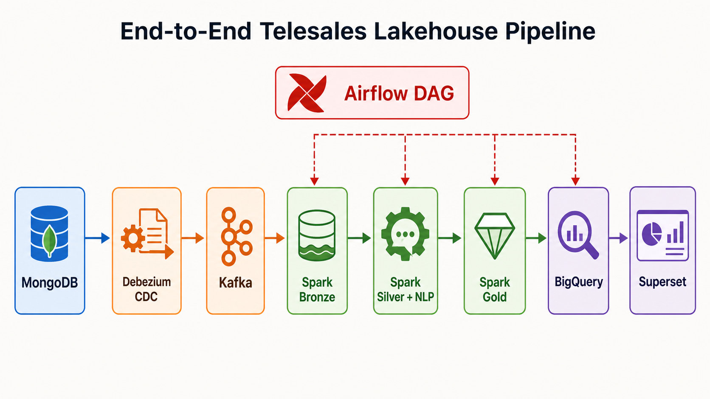

# Huong dan demo end-to-end he thong

Muc tieu demo: chung minh du lieu di tron luong tu **MongoDB -> Debezium -> Kafka -> Spark Lakehouse -> BigQuery -> Superset**.



## 1. Cau noi mo dau

He thong cua em xay dung mot Hybrid Data Lakehouse cho bai toan phan tich telesales. Du lieu nguon nam trong MongoDB, Debezium bat thay doi bang CDC va dua vao Kafka. Spark xu ly du lieu qua cac lop Bronze, Silver va Gold tren Lakehouse/Iceberg. Sau do Gold duoc dong bo sang BigQuery va Superset dung BigQuery de hien thi dashboard BI.

O lop Silver, he thong lam sach du lieu, deduplicate va ap dung mo hinh NLP Bag-of-Words de sinh `call_code` tu transcript. Transcript va PII khong duoc dua len dashboard serving.

## 2. Checklist truoc khi demo

| Can kiem tra | Lenh/man hinh | Ket qua mong doi |
|---|---|---|
| Docker Desktop | Mo Docker Desktop | Engine dang chay |
| Google Cloud auth | `gcloud.cmd auth list` | Co tai khoan active |
| BigQuery project | `gcloud.cmd config set project project-ef0c6db5-0765-4391-845` | Dung project do an |
| ADC credentials | `gcloud.cmd auth application-default login` | Airflow/Superset doc duoc BigQuery |
| Docker stack | `docker compose -f ".\project\docker-compose.yml" ps -a` | Service chinh `Up`, init job `Exited (0)` |

## 3. Cac buoc demo

| Buoc | Can show | Noi ngan gon |
|---|---|---|
| 1. Start stack | `docker compose -f ".\project\docker-compose.yml" up -d --build` | "Em khoi dong toan bo cac tang bang Docker Compose." |
| 2. Kiem tra container | `docker compose -f ".\project\docker-compose.yml" ps -a` | "Cac service chinh nhu MongoDB, Kafka, Debezium, Spark, Airflow va Superset dang chay." |
| 3. Source MongoDB | Container `mongodb`, init job `mongo-data-init` | "MongoDB la he thong nguon chua customer, offer va call logs." |
| 4. Debezium CDC | `docker exec debezium_connect curl -fsS http://localhost:8083/connectors/mongo-source/status` | "Debezium bat thay doi tu MongoDB va tao event CDC." |
| 5. Kafka | `docker exec kafka kafka-topics --bootstrap-server kafka:29092 --list` | "Kafka luu cac event CDC de Spark doc vao Lakehouse." |
| 6. Airflow DAG | Mo `http://localhost:8081`, login `admin/admin`, trigger `telesales_lakehouse_pipeline` | "Airflow dieu phoi toan bo pipeline tu Bronze den BigQuery." |
| 7. Bronze | Task `*.bronze` mau xanh | "Bronze luu raw CDC event, giu lineage tu nguon." |
| 8. Silver | Task `*.silver` mau xanh | "Silver lam sach, deduplicate, masking/drop PII va sinh `call_code` bang NLP." |
| 9. Gold | Task group `primary_telesales.gold` mau xanh | "Gold xay Star Schema gom fact va dimension phuc vu BI." |
| 10. CallCenterEN | Task group `callcenteren_external` mau xanh | "Nhanh nay chung minh he thong mo rong duoc sang nguon hoi thoai ben ngoai." |
| 11. BigQuery sync | Task `bq_sync_gold` mau xanh | "Gold duoc publish sang BigQuery lam serving layer." |
| 12. Serving view | Chay file SQL `project\bigquery\create_serving_views.sql` | "View nay join san du lieu de BI truy van de hon." |
| 13. Superset | Mo `http://localhost:8088`, login `admin/admin`, dashboard `Telesales BigQuery Dashboard` | "Superset hien thi KPI, outcome, xu huong cuoc goi va hieu suat agent." |

## 4. Vai tro cua tung step trong do an va bao cao

| Buoc | Vai tro trong he thong | Lam gi trong do an | Doi chieu voi bao cao |
|---|---|---|---|
| 1. Start stack | Khoi dong moi truong thuc nghiem | Tao day du cac service can de chay pipeline local | Chuong 3: kien truc trien khai; Chuong 4: moi truong kiem thu |
| 2. Kiem tra container | Chung minh he thong san sang | Xac nhan MongoDB, Kafka, Debezium, MinIO, Spark, Airflow, Superset da chay | Chuong 4: kiem thu van hanh he thong |
| 3. Source MongoDB | Tang du lieu nguon operational | Luu customer, offer va call logs truoc khi CDC | Chuong 2: mo ta du lieu; Chuong 3: tang source database |
| 4. Debezium CDC | Tang thu nhan thay doi | Bat thay doi tu MongoDB va tao CDC event | Chuong 1: ly thuyet CDC/Debezium; Chuong 3: thiet ke ingestion |
| 5. Kafka | Tang streaming trung gian | Luu event CDC de Spark doc theo luong | Chuong 1: Apache Kafka; Chuong 3: streaming layer |
| 6. Airflow DAG | Tang dieu phoi pipeline | Sap xep thu tu Bronze, Silver, Gold, CallCenterEN va BigQuery sync | Chuong 1: Airflow; Chuong 3: orchestration; Chuong 4: kiem thu DAG |
| 7. Bronze | Lop raw trong Lakehouse | Ghi raw CDC event, giu lineage va kha nang tai xu ly | Chuong 1: Medallion/Lakehouse; Chuong 3: thiet ke Bronze; Chuong 4: ket qua ETL |
| 8. Silver | Lop du lieu sach | Deduplicate, chuan hoa schema, masking/drop PII, sinh `call_code` bang BoW | Chuong 2: xu ly du lieu/mo hinh; Chuong 3: thiet ke Silver; Chuong 4: thuc nghiem NLP |
| 9. Gold | Lop phan tich | Xay Star Schema gom fact va dimension cho BI | Chuong 1: Star Schema/BI; Chuong 3: thiet ke Gold; Chuong 4: row count Gold |
| 10. CallCenterEN | Nhanh du lieu thu hai | Xu ly CallCenterEN nhu mot nhanh tuong duong voi AGI Telesales | Chuong 2: hai nhanh du lieu; Chuong 3: multi-source architecture; Chuong 4: kiem thu CallCenterEN |
| 11. BigQuery sync | Tang serving ben ngoai | Publish Gold tables sang BigQuery de BI truy van | Chuong 1: BigQuery; Chuong 3: serving layer; Chuong 4: BigQuery verification |
| 12. Serving view | Lop semantic cho BI | Tao view join san, giam do phuc tap cho dashboard | Chuong 3: thiet ke serving/BI; Chuong 4: kiem thu serving view |
| 13. Superset | Tang truc quan hoa | Hien thi KPI, outcome, xu huong va hieu suat agent | Chuong 1: Superset; Chuong 3: BI layer; Chuong 4: dashboard validation |

## 5. Lenh dung khi demo

```powershell
docker compose -f ".\project\docker-compose.yml" up -d --build
docker compose -f ".\project\docker-compose.yml" ps -a
```

```powershell
docker exec debezium_connect curl -fsS http://localhost:8083/connectors/mongo-source/status
docker exec kafka kafka-topics --bootstrap-server kafka:29092 --list
```

```powershell
docker exec airflow airflow dags trigger telesales_lakehouse_pipeline
docker exec airflow airflow dags list-runs -d telesales_lakehouse_pipeline
```

```powershell
Get-Content -Raw ".\project\bigquery\create_serving_views.sql" | bq.cmd query --use_legacy_sql=false
```

## 6. Row count mong doi

| Object | Rows |
|---|---:|
| `dim_customer` | 4,344 |
| `dim_offer` | 5,072 |
| `dim_date` | 2 |
| `fact_telesales_calls` | 23,447 |
| `vw_telesales_performance` | 23,447 |

## 7. Diem can nhan manh tren Superset

| Dashboard item | Y nghia |
|---|---|
| Total Calls | Quy mo du lieu da xu ly |
| Successful Sales | So cuoc goi thanh cong |
| Success Rate | Metric chinh cua telesales |
| Calls by Date | Xu huong cuoc goi theo ngay |
| Outcome Breakdown | Phan bo ket qua cuoc goi |
| Agent Performance | So sanh hieu suat agent |

Note: Dashboard Superset hien tai tap trung vao `vw_telesales_performance`. De chung minh them CallCenterEN, mo BigQuery va show cac view:

- `vw_callcenteren_labeled`
- `vw_callcenteren_performance`
- `vw_callcenteren_call_codes`

## 8. Cau ket demo

Qua demo nay, em chung minh he thong da chay end-to-end: tu MongoDB, qua Debezium CDC va Kafka, xu ly Lakehouse bang Spark theo Bronze/Silver/Gold, dong bo sang BigQuery va hien thi tren Superset. He thong dam bao duoc data lineage, kha nang tai xu ly, NLP enrichment va kiem soat PII truoc khi dua du lieu len BI.
