# Report V7 Index Graph

Ngu?n: `docs/reports/Report KLTN - 22133056 - Nguyen Quoc Thinh - 26-06 - v7 callcenteren star schema bq verification.docx`

Sinh l?c: `2026-06-27T07:59:20`

## Summary

- Nodes: 251
- Edges: 250
- Heading 1: 14
- Heading 2: 51
- Heading 3: 133
- Figure captions: 22
- Table captions: 24
- DOCX tables: 73
- Inline images: 0

## Mermaid Overview

```mermaid
graph TD
  R["Report v7"]
  R --> h1_95_m_c_l_c["MỤC LỤC"]
  R --> h1_149_danh_m_c_h_nh_nh["DANH MỤC HÌNH ẢNH"]
  R --> h1_176_danh_m_c_b_ng["DANH MỤC BẢNG"]
  R --> h1_203_danh_m_c_k_hi_u_v_c_c_ch_vi_t_t_t["DANH MỤC KÝ HIỆU VÀ CÁC CHỮ VIẾT TẮT"]
  R --> h1_205_ph_n_m_u["PHẦN MỞ ĐẦU"]
  h1_205_ph_n_m_u --> h2_206_1_1_t_nh_c_p_thi_t_c_a_t_i["1.1. TÍNH CẤP THIẾT CỦA ĐỀ TÀI"]
  h1_205_ph_n_m_u --> h2_212_1_2_m_c_ch_c_a_t_i["1.2. MỤC ĐÍCH CỦA ĐỀ TÀI"]
  h1_205_ph_n_m_u --> h2_221_1_3_c_ch_ti_p_c_n_v_ph_ng_ph_p_nghi_n_c_u["1.3. CÁCH TIẾP CẬN VÀ PHƯƠNG PHÁP NGHIÊN CỨU"]
  h1_205_ph_n_m_u --> h2_228_1_4_m_t_s_c_ng_tr_nh_nghi_n_c_u_trong_v_ngo_i_n_c["1.4. MỘT SỐ CÔNG TRÌNH NGHIÊN CỨU TRONG VÀ NGOÀI NƯỚC"]
  h1_205_ph_n_m_u --> h2_232_1_5_k_t_qu_t_c["1.5. KẾT QUẢ ĐẠT ĐƯỢC"]
  R --> h1_234_ph_n_n_i_dung["PHẦN NỘI DUNG"]
  R --> h1_235_ch_ng_1_c_s_l_thuy_t["Chương 1: CƠ SỞ LÝ THUYẾT"]
  h1_235_ch_ng_1_c_s_l_thuy_t --> h2_237_1_1_t_ng_quan_v_ki_n_tr_c_d_li_u_hi_n_i["1.1. Tổng quan về kiến trúc dữ liệu hiện đại"]
  h1_235_ch_ng_1_c_s_l_thuy_t --> h2_257_1_2_ki_n_tr_c_medallion["1.2. Kiến trúc Medallion"]
  h1_235_ch_ng_1_c_s_l_thuy_t --> h2_262_1_3_thu_th_p_d_li_u_thay_i_theo_th_i_gian_th_c["1.3. Thu thập dữ liệu thay đổi theo thời gian thực"]
  h1_235_ch_ng_1_c_s_l_thuy_t --> h2_281_1_4_c_ng_ngh_x_l_v_l_u_tr_d_li_u_l_n["1.4. Công nghệ xử lý và lưu trữ dữ liệu lớn"]
  h1_235_ch_ng_1_c_s_l_thuy_t --> h2_299_1_5_b_o_m_t_d_li_u_c_nh_n_v_khai_ph_d_li_u_h_i_tho_i["1.5. Bảo mật dữ liệu cá nhân và khai phá dữ liệu hội thoại"]
  h1_235_ch_ng_1_c_s_l_thuy_t --> h2_308_1_6_i_u_ph_i_pipeline_v_ph_c_v_ph_n_t_ch["1.6. Điều phối pipeline và phục vụ phân tích"]
  h1_235_ch_ng_1_c_s_l_thuy_t --> h2_327_1_7_l_a_ch_n_ki_n_tr_c_theo_y_u_c_u_d_li_u_telesales["1.7. Lựa chọn kiến trúc theo yêu cầu dữ liệu Telesales"]
  h1_235_ch_ng_1_c_s_l_thuy_t --> h2_361_1_8_c_i_m_d_li_u_cu_c_g_i_v_transcript["1.8. Đặc điểm dữ liệu cuộc gọi và transcript"]
  h1_235_ch_ng_1_c_s_l_thuy_t --> h2_388_1_9_v_n_t_ch_t_i_oltp_v_olap["1.9. Vấn đề tách tải OLTP và OLAP"]
  h1_235_ch_ng_1_c_s_l_thuy_t --> h2_410_1_10_vai_tr_c_a_schema_evolution_trong_lakehouse["1.10. Vai trò của schema evolution trong Lakehouse"]
  h1_235_ch_ng_1_c_s_l_thuy_t --> h2_442_1_11_vai_tr_c_a_metadata_trong_truy_v_t_d_li_u["1.11. Vai trò của metadata trong truy vết dữ liệu"]
  h1_235_ch_ng_1_c_s_l_thuy_t --> h2_474_1_12_data_quality_trong_ki_n_tr_c_medallion["1.12. Data quality trong kiến trúc Medallion"]
  h1_235_ch_ng_1_c_s_l_thuy_t --> h2_494_1_13_b_o_m_t_pii_trong_pipeline_ph_n_t_ch["1.13. Bảo mật PII trong pipeline phân tích"]
  h1_235_ch_ng_1_c_s_l_thuy_t --> h2_516_1_14_machine_learning_trong_pipeline_d_li_u["1.14. Machine Learning trong pipeline dữ liệu"]
  h1_235_ch_ng_1_c_s_l_thuy_t --> h2_560_1_15_m_h_nh_star_schema_cho_dashboard_v_n_h_nh["1.15. Mô hình Star Schema cho dashboard vận hành"]
  h1_235_ch_ng_1_c_s_l_thuy_t --> h2_583_1_16_l_p_serving_v_semantic_layer_cho_bi["1.16. Lớp serving và semantic layer cho BI"]
  h1_235_ch_ng_1_c_s_l_thuy_t --> h2_604_1_17_t_ng_h_p_ti_u_ch_l_a_ch_n_c_ng_ngh["1.17. Tổng hợp tiêu chí lựa chọn công nghệ"]
  h1_235_ch_ng_1_c_s_l_thuy_t --> h2_625_1_18_k_t_lu_n_ch_ng["1.18. Kết luận chương"]
  R --> h1_628_ch_ng_2_b_d_li_u_m_h_nh_sinh_d_li_u_v_m_h_nh_nlp["Chương 2: BỘ DỮ LIỆU, MÔ HÌNH SINH DỮ LIỆU VÀ MÔ HÌNH NLP"]
  h1_628_ch_ng_2_b_d_li_u_m_h_nh_sinh_d_li_u_v_m_h_nh_nlp --> h2_635_2_1_vai_tr_c_a_d_li_u_trong_t_i["2.1. Vai trò của dữ liệu trong đề tài"]
  h1_628_ch_ng_2_b_d_li_u_m_h_nh_sinh_d_li_u_v_m_h_nh_nlp --> h2_674_2_2_ngu_n_g_c_v_quy_tr_nh_sinh_d_li_u["2.2. Nguồn gốc và quy trình sinh dữ liệu"]
  h1_628_ch_ng_2_b_d_li_u_m_h_nh_sinh_d_li_u_v_m_h_nh_nlp --> h2_693_2_3_thi_t_k_schema_v_t_nh_ch_t_d_li_u["2.3. Thiết kế schema và tính chất dữ liệu"]
  h1_628_ch_ng_2_b_d_li_u_m_h_nh_sinh_d_li_u_v_m_h_nh_nlp --> h2_729_2_4_chu_n_h_a_d_li_u_th_nh_c_c_th_c_th_ngu_n["2.4. Chuẩn hóa dữ liệu thành các thực thể nguồn"]
  h1_628_ch_ng_2_b_d_li_u_m_h_nh_sinh_d_li_u_v_m_h_nh_nlp --> h2_740_2_5_chu_n_b_d_li_u_hu_n_luy_n_nlp["2.5. Chuẩn bị dữ liệu huấn luyện NLP"]
  h1_628_ch_ng_2_b_d_li_u_m_h_nh_sinh_d_li_u_v_m_h_nh_nlp --> h2_753_2_6_m_h_nh_nlp_ph_n_lo_i_call_code["2.6. Mô hình NLP phân loại call_code"]
  h1_628_ch_ng_2_b_d_li_u_m_h_nh_sinh_d_li_u_v_m_h_nh_nlp --> h2_791_2_7_data_quality_o_c_d_li_u_v_gi_i_h_n_c_a_d_li_u_t_ng_h_p["2.7. Data quality, đạo đức dữ liệu và giới hạn của dữ liệu tổng hợp"]
  R --> h1_804_ch_ng_3_ph_n_t_ch_v_thi_t_k_ki_n_tr_c_hybrid_data_lakehouse["Chương 3: PHÂN TÍCH VÀ THIẾT KẾ KIẾN TRÚC HYBRID DATA LAKEHOUSE"]
  h1_804_ch_ng_3_ph_n_t_ch_v_thi_t_k_ki_n_tr_c_hybrid_data_lakehouse --> h2_810_3_1_y_u_c_u_h_th_ng_agi_telesales["3.1. Yêu cầu hệ thống AGI Telesales"]
  h1_804_ch_ng_3_ph_n_t_ch_v_thi_t_k_ki_n_tr_c_hybrid_data_lakehouse --> h2_820_3_2_ki_n_tr_c_t_ng_th["3.2. Kiến trúc tổng thể"]
  h1_804_ch_ng_3_ph_n_t_ch_v_thi_t_k_ki_n_tr_c_hybrid_data_lakehouse --> h2_835_3_3_thi_t_k_ngu_n_d_li_u_v_cdc["3.3. Thiết kế nguồn dữ liệu và CDC"]
  h1_804_ch_ng_3_ph_n_t_ch_v_thi_t_k_ki_n_tr_c_hybrid_data_lakehouse --> h2_847_3_4_thi_t_k_c_c_t_ng_medallion["3.4. Thiết kế các tầng Medallion"]
  h1_804_ch_ng_3_ph_n_t_ch_v_thi_t_k_ki_n_tr_c_hybrid_data_lakehouse --> h2_866_3_5_thi_t_k_i_u_ph_i_serving_v_bi["3.5. Thiết kế điều phối, serving và BI"]
  h1_804_ch_ng_3_ph_n_t_ch_v_thi_t_k_ki_n_tr_c_hybrid_data_lakehouse --> h2_880_3_6_thi_t_k_b_o_m_t_v_kh_n_ng_v_n_h_nh["3.6. Thiết kế bảo mật và khả năng vận hành"]
  R --> h1_894_ch_ng_4_tri_n_khai_th_c_nghi_m_v_ki_m_th_h_th_ng["Chương 4: TRIỂN KHAI, THỰC NGHIỆM VÀ KIỂM THỬ HỆ THỐNG"]
  h1_894_ch_ng_4_tri_n_khai_th_c_nghi_m_v_ki_m_th_h_th_ng --> h2_898_4_1_m_i_tr_ng_tri_n_khai["4.1. Môi trường triển khai"]
  h1_894_ch_ng_4_tri_n_khai_th_c_nghi_m_v_ki_m_th_h_th_ng --> h2_905_4_2_bootstrap_d_li_u_v_cdc["4.2. Bootstrap dữ liệu và CDC"]
  h1_894_ch_ng_4_tri_n_khai_th_c_nghi_m_v_ki_m_th_h_th_ng --> h2_913_4_3_ki_m_th_bronze_silver_gold["4.3. Kiểm thử Bronze, Silver, Gold"]
  h1_894_ch_ng_4_tri_n_khai_th_c_nghi_m_v_ki_m_th_h_th_ng --> h2_930_4_4_ki_m_th_bigquery_superset_v_dashboard["4.4. Kiểm thử BigQuery, Superset và dashboard"]
  h1_894_ch_ng_4_tri_n_khai_th_c_nghi_m_v_ki_m_th_h_th_ng --> h2_945_4_5_nh_gi_nlp_trong_pipeline["4.5. Đánh giá NLP trong pipeline"]
  h1_894_ch_ng_4_tri_n_khai_th_c_nghi_m_v_ki_m_th_h_th_ng --> h2_979_4_6_ki_m_th_kh_n_ng_ch_y_l_i_v_ph_c_h_i_l_i["4.6. Kiểm thử khả năng chạy lại và phục hồi lỗi"]
  R --> h1_1001_ch_ng_5_nh_gi_t_ng_h_p_h_n_ch_v_h_ng_ph_t_tri_n["Chương 5: ĐÁNH GIÁ TỔNG HỢP, HẠN CHẾ VÀ HƯỚNG PHÁT TRIỂN"]
  h1_1001_ch_ng_5_nh_gi_t_ng_h_p_h_n_ch_v_h_ng_ph_t_tri_n --> h2_1003_5_1_m_c_p_ng_m_c_ti_u_t_i["5.1. Mức độ đáp ứng mục tiêu đề tài"]
  h1_1001_ch_ng_5_nh_gi_t_ng_h_p_h_n_ch_v_h_ng_ph_t_tri_n --> h2_1013_5_2_nh_gi_ng_g_p_k_thu_t["5.2. Đánh giá đóng góp kỹ thuật"]
  h1_1001_ch_ng_5_nh_gi_t_ng_h_p_h_n_ch_v_h_ng_ph_t_tri_n --> h2_1026_5_3_h_n_ch["5.3. Hạn chế"]
  h1_1001_ch_ng_5_nh_gi_t_ng_h_p_h_n_ch_v_h_ng_ph_t_tri_n --> h2_1039_5_4_h_ng_ph_t_tri_n["5.4. Hướng phát triển"]
  R --> h1_1050_ph_n_k_t_lu_n["PHẦN KẾT LUẬN"]
  h1_1050_ph_n_k_t_lu_n --> h2_1054_ghi_ch_phi_n_b_n_v7["Ghi chú phiên bản v7"]
  R --> h1_1056_t_i_li_u_tham_kh_o["TÀI LIỆU THAM KHẢO"]
  R --> h1_1095_ph_l_c["PHỤ LỤC"]
  h1_1095_ph_l_c --> h2_1096_ph_l_c_a_l_nh_v_n_h_nh_ch_nh["Phụ lục A. Lệnh vận hành chính"]
  h1_1095_ph_l_c --> h2_1098_ph_l_c_b_danh_s_ch_s_v_h_nh_minh_h_a["Phụ lục B. Danh sách sơ đồ và hình minh họa"]
  h1_1095_ph_l_c --> h2_1100_ph_l_c_c_ghi_ch_b_o_m_t["Phụ lục C. Ghi chú bảo mật"]
  h1_1095_ph_l_c --> h2_1103_ph_l_c_d_b_ng_i_chi_u_code_v_n_i_dung_b_o_c_o["Phụ lục D. Bảng đối chiếu code và nội dung báo cáo"]
```

## Chapter Index

- **MỤC LỤC** - 0 m?c c?p 2 tr?c ti?p
- **DANH MỤC HÌNH ẢNH** - 0 m?c c?p 2 tr?c ti?p
- **DANH MỤC BẢNG** - 0 m?c c?p 2 tr?c ti?p
- **DANH MỤC KÝ HIỆU VÀ CÁC CHỮ VIẾT TẮT** - 0 m?c c?p 2 tr?c ti?p
- **PHẦN MỞ ĐẦU** - 5 m?c c?p 2 tr?c ti?p
- **PHẦN NỘI DUNG** - 0 m?c c?p 2 tr?c ti?p
- **Chương 1: CƠ SỞ LÝ THUYẾT** - 18 m?c c?p 2 tr?c ti?p
- **Chương 2: BỘ DỮ LIỆU, MÔ HÌNH SINH DỮ LIỆU VÀ MÔ HÌNH NLP** - 7 m?c c?p 2 tr?c ti?p
- **Chương 3: PHÂN TÍCH VÀ THIẾT KẾ KIẾN TRÚC HYBRID DATA LAKEHOUSE** - 6 m?c c?p 2 tr?c ti?p
- **Chương 4: TRIỂN KHAI, THỰC NGHIỆM VÀ KIỂM THỬ HỆ THỐNG** - 6 m?c c?p 2 tr?c ti?p
- **Chương 5: ĐÁNH GIÁ TỔNG HỢP, HẠN CHẾ VÀ HƯỚNG PHÁT TRIỂN** - 4 m?c c?p 2 tr?c ti?p
- **PHẦN KẾT LUẬN** - 1 m?c c?p 2 tr?c ti?p
- **TÀI LIỆU THAM KHẢO** - 0 m?c c?p 2 tr?c ti?p
- **PHỤ LỤC** - 4 m?c c?p 2 tr?c ti?p

## Key Evidence Captions

- `table` p#750: Bảng 2.11. Kết quả chuẩn bị split CallCenterEN sau pseudo-label
- `figure` p#828: Hình 3.7. Data lineage từ MongoDB đến BigQuery serving view
- `figure` p#844: Hình 3.8. Sequence diagram CDC và batch ETL trong pipeline
- `table` p#863: Bảng 3.4. Thiết kế Star Schema ở tầng Gold
- `figure` p#865: Hình 3.4. Star Schema của lớp Gold phục vụ BI
- `table` p#870: Bảng 3.5. Airflow DAG và dependency chính
- `figure` p#872: Hình 3.5. Airflow DAG điều phối Bronze, Silver, Gold và BigQuery sync
- `table` p#923: Bảng 4.1. Kết quả kiểm thử dữ liệu và pipeline chính
- `figure` p#926: Hình 4.5. Kiểm chứng row count giữa MongoDB, Iceberg Gold và BigQuery
- `table` p#928: Bảng 4.2. Checklist nghiệm thu kỹ thuật cho pipeline
- `figure` p#937: Hình 4.4. Luồng phục vụ dữ liệu từ Gold Iceberg sang BigQuery serving view
- `figure` p#939: Hình 4.8. Dashboard phân tích outcome, lead source và product performance
- `figure` p#942: Hình 4.3. Dashboard Superset/BI cho phân tích hiệu suất telesales
- `table` p#969: Bảng 4.5. Kết quả huấn luyện và tinh chỉnh model riêng cho CallCenterEN
- `table` p#977: Bảng 4.7. Kết quả ghi bảng Lakehouse cho nhánh CallCenterEN
- `table` p#1000: Bảng 4.8. Kết quả kiểm thử full pipeline tuần tự ngày 26/06/2026

## Files

- Graph JSON: `docs/drafts/REPORT_V7_INDEX_GRAPH.json`
- Graph Markdown: `docs/drafts/REPORT_V7_INDEX_GRAPH.md`
